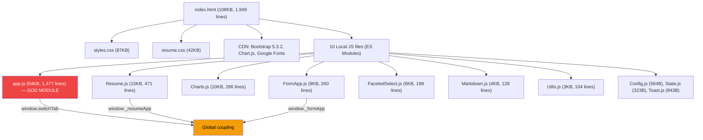

# Interviewz (OpportunityTracker) — Codebase & Performance Analysis Report

> **Date:** June 21, 2026  
> **Scope:** Full codebase review — HTML, CSS, JavaScript, deployment, project configuration  
> **Context:** Pre-public-release study; currently single-user (personal use)

---

## Executive Summary

Interviewz/OpportunityTracker is a well-conceived **Job Application Tracker SPA** built with vanilla HTML/CSS/JS, Bootstrap 5, and Chart.js. It features: a landing page, dashboard analytics, application CRUD (synced to Google Sheets), filterable/sortable application registry, application detail drawer, active interviews panel, custom calendar-style resume section with particle canvas animations, and dark/light theme support.

The design system is genuinely impressive — 110+ CSS custom properties, scoped resume styling, dark mode, responsive breakpoints, and tasteful animations. The JS codebase already uses **ES Modules**, which is a strong foundation.

However, the codebase has accumulated **architectural and performance debt** that will become a barrier to public release:

| Category | Health | Key Issue |
|----------|--------|-----------|
| Architecture | 🟡 Moderate | `app.js` is a 1,477-line god module; `window` coupling between modules |
| Performance | 🔴 Critical | Resume particle animation: O(n²) per frame + `getComputedStyle()` 60×/sec |
| Security | 🟡 Moderate | Hardcoded API endpoints; Chart.js CDN without SRI hash |
| Code Quality | 🟡 Moderate | No linter/formatter/tests; significant code duplication (5× filter logic) |
| Accessibility | 🟡 Moderate | Good ARIA foundation but gaps: keyboard traps, `prefers-reduced-motion`, skip-link |
| CSS | 🟡 Moderate | 130KB unminified; 45 `!important`s; 4× duplicated matrix grid; no print styles |
| Deployment | 🟡 Moderate | Manual script, no CI/CD, no staging environment |

---

## 1. Architecture

### 1.1 Current State



### 1.2 Module Dependency Map

```
Config.js ──────────────────────> (no deps)
State.js ───────────────────────> (no deps)
Utils.js ───────────────────────> Config.js
Toast.js ───────────────────────> Utils.js
Markdown.js ────────────────────> Utils.js
FacetedSelect.js ───────────────> (no deps)
Charts.js ──────────────────────> Utils.js
FormApp.js ─────────────────────> Toast.js, Utils.js, Config.js
Resume.js ──────────────────────> (no deps, uses window global)
app.js ─────────────────────────> ALL of the above
```

**Global/window coupling:**
- `Resume.js` writes `window._resumeApp`
- `app.js` writes `window.switchTab`, reads `window._resumeApp`, writes `window._formApp`
- `FormApp.js` reads `window.switchTab`

### 1.3 Key Problems

#### 🔴 God Module: [app.js](file:///c:/devland/interviewz/js/app.js) (1,477 lines)

This single file handles **all** of the following:

| Responsibility | Lines | Complexity |
|---|---|---|
| DOM caching (`initDomCache`) | 24–103 | 50+ cached references |
| Event setup (`setupEventListeners`) | 162–439 | **280-line monolith** |
| Data fetching + CSV parsing | 444–576 | Network + offline cache |
| Statistics calculation | 625–711 | Single-pass aggregation |
| Filter UI + filter logic | 713–874 | Cross-filter updates |
| Table rendering + pagination | 892–968 | DocumentFragment |
| Detail drawer (`openDetailsDrawer`) | 996–1154 | **160-line function** |
| Tab navigation (`initTabNavigation`) | 1183–1325 | **116-line nested function** |
| Interview notes submission | 1348–1385 | POST via Utils |
| Active interviews panel | 1387–1476 | Card rendering |

> [!CAUTION]
> `setupEventListeners()` at 280 lines is the single largest function. `openDetailsDrawer()` at 160 lines is the second. Both should be decomposed by feature area.

#### 🟡 Window Coupling Bypasses Module System

Despite using ES Modules, three modules communicate via `window` properties:
- `window.switchTab` (set in app.js, read in FormApp.js)
- `window._resumeApp` (set in Resume.js, read in app.js)
- `window._formApp` (set in app.js)

This defeats the purpose of ES Modules and creates hidden coupling.

#### 🟡 Mutable State Without Reactivity

[State.js](file:///c:/devland/interviewz/js/State.js) is a plain mutable object (17 lines) with 10 properties and no change events, no validation, no immutability guards. Any module can mutate it freely with no traceability.

---

## 2. Performance

### 2.1 Loading Performance

| Issue | Impact | Details |
|-------|--------|---------|
| **No bundling/minification** | High | 130KB unminified CSS + 100KB unminified JS served raw |
| **Render-blocking CSS** | High | Both stylesheets (130KB total) in `<head>`, blocking first paint |
| **4 Google Font families** | Medium | Roboto, Space Grotesk, Inter, JetBrains Mono — potentially loading 20+ font files |
| **No critical CSS extraction** | Medium | All 5,500 lines of CSS loaded regardless of which tab is active |
| **Manual cache busting** | Low | `?v=41` / `?v=1` query strings — fragile, easy to forget |

#### Estimated Initial Load Budget

```
CSS:         ~130 KB (unminified) → ~85 KB minified → ~15 KB gzipped
JS (local):  ~100 KB (unminified) → ~60 KB minified → ~12 KB gzipped
JS (CDN):    ~90 KB (Bootstrap + Chart.js)
Fonts:       ~100 KB (4 families, multiple weights)
Images:      ~50 KB (favicon + avatar)
───────────────────────────────────────────────────
Total:       ~470 KB+ before first meaningful paint
```

> [!TIP]
> Good practice already: `<link rel="preconnect">` hints exist for font and CDN domains. Bootstrap loads with SRI hashes. Chart.js is `defer`ed.

### 2.2 Runtime Performance — Critical Hotspots

#### 🔴 Resume.js Particle Animation — O(n²) Per Frame

The most significant performance issue in the entire codebase lives in [Resume.js](file:///c:/devland/interviewz/js/Resume.js):

```
_updateAndDrawCanvas() — lines 196–215:
- 110 particles per canvas × 2 canvases = 220 particles
- Nested loop comparing every pair for proximity lines
- ~12,000 distance calculations per frame at 60fps
- That's ~720,000 calculations per second
```

> [!WARNING]
> This is running continuously whenever the resume tab is visible. On lower-end devices, this will cause janky scrolling and battery drain.

#### 🔴 `getComputedStyle()` Called Every Animation Frame

```
_updateAndDrawCanvas() → _getColorRgb('--rm-canvas-accent')
  → getComputedStyle(document.documentElement) — 60 times per second per canvas
```

`getComputedStyle()` triggers a style recalculation. Calling it at 60fps (120×/sec with 2 canvases) is a significant layout thrashing source. **Should be cached and only re-read on theme change.**

#### 🟡 Other Runtime Issues

| Issue | Impact | Location |
|-------|--------|----------|
| `updateFiltersUI()` filters `activeApplications` 3 separate times | Medium | [app.js](file:///c:/devland/interviewz/js/app.js) L713–799 |
| Interview cards appended one-by-one instead of via DocumentFragment | Low | [app.js](file:///c:/devland/interviewz/js/app.js) L1474 (contrast with table rendering which correctly uses Fragment at L921) |
| `innerHTML = ''` clears and recreates all DOM nodes on every re-render | Medium | [app.js](file:///c:/devland/interviewz/js/app.js) L894, L1420 |
| Chart tooltip config (~5 properties) duplicated across all 4 chart functions | Low | [Charts.js](file:///c:/devland/interviewz/js/Charts.js) |

### 2.3 CSS Performance

| Issue | Impact | Details |
|-------|--------|---------|
| **`backdrop-filter: blur()`** × 5 uses | Medium | GPU-intensive, especially `blur(16px) saturate(1.4)` on `.resume-card` |
| **`filter: blur(80px)`** on 320×320px elements | Medium | CTA glow blobs in landing page |
| **`transition: all`** in ~6 places | Low | Forces browser to watch all properties; should list specific ones |
| **`background-position` animation** | Low | `cta-gradient-flow` not GPU-composited |
| **No `prefers-reduced-motion`** in styles.css | Medium | resume.css has it ✅; styles.css does not ❌ |

---

## 3. Security

> [!IMPORTANT]
> These issues are acceptable for personal use but **must be addressed before public release**.

| Issue | Severity | Details |
|-------|----------|---------|
| **Hardcoded Google Sheets URL** | 🟡 Medium | [Config.js](file:///c:/devland/interviewz/js/Config.js) exposes the full Google Sheets document ID in `SHEET_EXPORT_URL` |
| **Hardcoded Tailscale webhook endpoints** | 🟡 Medium | `FORM_API_ENDPOINT` and `NOTES_API_ENDPOINT` in [Config.js](file:///c:/devland/interviewz/js/Config.js) are Tailscale URLs — less risky (private network) but still exposed in source |
| **Chart.js CDN without SRI hash** | 🟡 Medium | Bootstrap has integrity hashes ✅ but Chart.js does not ⚠️ — inconsistent security posture |
| **No Content Security Policy** | 🟡 Low | No CSP meta tag restricting inline scripts or CDN sources |
| **Markdown.js fragile sanitization** | 🟡 Low | [Markdown.js](file:///c:/devland/interviewz/js/Markdown.js) calls `escapeHtml()` first, then applies regex to re-introduce HTML tags. Order-of-operations is correct but fragile. |
| **No `<noscript>` fallback** | ⚪ Info | App is entirely JS-dependent with no graceful degradation message |

**Positive:** `escapeHtml()` in [Utils.js](file:///c:/devland/interviewz/js/Utils.js) is used properly in Toast and other rendering paths ✅

---

## 4. Code Quality

### 4.1 Tooling Gap

| Tool | Status | Recommendation |
|------|--------|----------------|
| Linter (ESLint) | ❌ Missing | Catches bugs, enforces consistency |
| Formatter (Prettier) | ❌ Missing | Eliminates style debates |
| Type checker (JSDoc/TS) | ❌ Missing | Prevents runtime type errors |
| Test framework | ❌ Missing | Ensures refactoring safety |
| Bundler (Vite) | ❌ Missing | Minification, code-splitting, HMR |
| Pre-commit hooks | ❌ Missing | Enforces quality gates |
| CI/CD | ❌ Missing | Automates lint + deploy |

### 4.2 Code Duplication

| Pattern | Occurrences | Files |
|---------|-------------|-------|
| Triple-filter match (`matchCompany && matchJob && matchStatus`) | **5×** | [app.js](file:///c:/devland/interviewz/js/app.js) L714, L760, L784, L808, L1394 |
| Active status check (`status !== 'ready' && status !== 'rejected' && ...`) | **2×** | [app.js](file:///c:/devland/interviewz/js/app.js) L658, L1392 |
| Chart tooltip config object | **4×** | [Charts.js](file:///c:/devland/interviewz/js/Charts.js) — all 4 chart functions |
| Weekday abbreviation array `['Su','Mo','Tu',...]` | **2×** | [Utils.js](file:///c:/devland/interviewz/js/Utils.js), [Charts.js](file:///c:/devland/interviewz/js/Charts.js) L53 |
| `"Not Defined"` default for hiring team | **3×** | [FormApp.js](file:///c:/devland/interviewz/js/FormApp.js) L53, L155, L201 |
| Matrix grid CSS pattern | **4×** | [styles.css](file:///c:/devland/interviewz/css/styles.css) (~240 lines of near-identical CSS) |
| Resume timeline data (node + detail card) | **2×** | [index.html](file:///c:/devland/interviewz/index.html) — same dates/companies in two HTML blocks |

### 4.3 Code Smells

1. **`CACHE_KEY_CSV()` unnecessary wrapper function** ([app.js](file:///c:/devland/interviewz/js/app.js) L521–523) — wraps a constant in a function call for no reason. Just use the imported constant directly.

2. **Dead configuration** — `FORM_TOAST_DURATION` is exported from [Config.js](file:///c:/devland/interviewz/js/Config.js) but never imported anywhere. Toast.js hardcodes `4000ms` instead.

3. **Missing error boundary** — `parseAndInitializeData()` in [app.js](file:///c:/devland/interviewz/js/app.js) has **no try/catch**. A corrupted CSV from Google Sheets could crash the entire application.

4. **Inconsistent DOM manipulation** — Table rendering correctly uses `DocumentFragment` ([app.js](file:///c:/devland/interviewz/js/app.js) L921), but interview cards don't ([app.js](file:///c:/devland/interviewz/js/app.js) L1474). Both do the same type of work.

5. **Resume.js auto-instantiation side effect** — [Resume.js](file:///c:/devland/interviewz/js/Resume.js) L469–470 creates a `ResumeApp` instance and assigns to `window._resumeApp` at import time. The `deactivate()` method exists but is never called when switching tabs away from resume.

6. **Tab visibility as if/else chain** — [app.js](file:///c:/devland/interviewz/js/app.js) L1227–1299 has a 6-branch if/else, each calling `showEl/hideEl` on 8–9 sections. Should be a data-driven mapping.

### 4.4 Hardcoded Magic Strings

Status strings like `'retired'`, `'rejected'`, `'ready'`, `'applied'`, `'withdraw'`, `'withdrawn'`, `'offer'`, `'accepted'` are scattered throughout [app.js](file:///c:/devland/interviewz/js/app.js) without a central enum. Column name strings like `'Company Name'`, `'Job Title'`, `'Application Status'`, `'Create Date'`, `'Job_Suitability'` are used as magic strings throughout data processing.

---

## 5. Accessibility (a11y)

### 5.1 Strengths ✅

The project has a **surprisingly strong a11y foundation** in the HTML:
- `<html lang="en">` declared ✅
- SVG sprite sheet with `aria-hidden="true"` ✅
- ~30+ instances of `aria-hidden="true"` on decorative icons ✅
- `aria-label` on interactive buttons (theme toggle, nav, close, pagination, FABs) ✅
- `aria-expanded` and `aria-haspopup="listbox"` on custom selects ✅
- `role="listbox"` / `role="option"` on dropdown items ✅
- Proper `role="tablist"` / `role="tab"` / `role="tabpanel"` on drawer tabs ✅
- `<label>` elements associated with form inputs ✅
- Semantic HTML: `<header>`, `<main>`, `<section>`, `<nav>`, `<footer>`, `<aside>`, `<article>` ✅

### 5.2 Remaining Gaps

| Issue | WCAG Criterion | Fix Effort |
|-------|---------------|------------|
| **Bento cards use `onclick` on `<div>`** — no `role="button"`, no `tabindex`, no keyboard handler | 2.1.1 (A) | Easy |
| **No skip-to-content link** | 2.4.1 (A) | Easy |
| **Multiple `<h1>` tags** (3: landing hero, hero banner, resume hero) | 1.3.1 (A) | Easy |
| **No `aria-live` regions** for dynamic content (table results, sync status) | 4.1.3 (AA) | Medium |
| **No `@media (prefers-reduced-motion)` in styles.css** (resume.css has it ✅) | 2.3.3 (AAA) | Easy |
| **Top nav buttons lack `role="tab"`** for the main page tab switching pattern | 4.1.2 (A) | Easy |
| **Form has `novalidate`** without equivalent JS validation announcements | 3.3.1 (A) | Medium |
| **No `prefers-color-scheme` media query** — dark mode only via JS toggle | 1.4.1 (A) | Easy |

---

## 6. CSS Architecture

### 6.1 Overview

| Metric | [styles.css](file:///c:/devland/interviewz/css/styles.css) | [resume.css](file:///c:/devland/interviewz/css/resume.css) | Total |
|--------|-------------|-------------|-------|
| File size | 87 KB | 42 KB | **130 KB** |
| Lines | ~3,898 | ~1,623 | **~5,521** |
| Custom properties | ~70 | ~40 (scoped) | **~110** |
| `@keyframes` | 9 | 3 | **12** |
| `@media` queries | 21 | 5 | **26** |
| `!important` uses | 29 | 16 | **45** |
| Est. rule sets | ~550–600 | ~220–250 | **~770–850** |

### 6.2 Strengths

- ✅ **Excellent design token system** — 110+ CSS custom properties covering colors, spacing, shadows, typography, transitions, z-index
- ✅ **Scoped resume variables** — `.resume-section` has its own self-contained custom property set
- ✅ **Modern CSS** — Uses `color-mix()` (6 instances in resume.css), `clamp()` for fluid typography
- ✅ **Dark mode** — Clean class-based toggle (`:root.theme-dark`) overriding CSS variables
- ✅ **Well-organized** — Clear section headers with `/* ========== */` comment blocks
- ✅ **Tasteful animations** — 12 keyframes, stagger delays via `nth-child`, purposeful transitions

### 6.3 Issues

| Issue | Severity | Details |
|-------|----------|---------|
| **4× duplicated matrix grid CSS** | 🟡 Medium | `.status-matrix-grid`, `.details-matrix-grid`, `.suitability-matrix-grid`, `.interview-matrix-grid` — ~240 lines of near-identical CSS |
| **45 `!important` declarations** | 🟡 Medium | ~29 in styles.css, ~16 in resume.css. Most justified (utilities, Bootstrap overrides) but some are code smells |
| **Hardcoded colors bypassing variables** | 🟡 Medium | `#e8eaed` appears 5× raw, `#f8f9fa` 2×, `#1557b0` 1×, `#a733ff` / `#e3b3ff` 3× |
| **Inconsistent breakpoints** | 🟡 Low | Mixed 640px/641px and 768px/767px in styles.css |
| **Dead CSS** | ⚪ Low | `#drawerInterviewCompany { max-height: none }` at L2033 immediately overridden at L2110 |
| **No `@media print` styles** | 🔴 High | Neither file has print styles — critical gap especially for resume tab |
| **No minification** | 🟡 Medium | 130KB served raw |

### 6.4 Quick Win: Reusable Gradient Variable

The primary gradient appears ~15 times across styles.css. Add to `:root`:

```css
:root {
  --gradient-primary: linear-gradient(135deg, var(--color-primary), var(--color-accent));
}
```

---

## 7. Landing Page & Introduction

### 7.1 In-App Landing Tab

The [index.html](file:///c:/devland/interviewz/index.html) landing tab (L116–312) features a hero section, bento-grid with screenshots, value propositions, and an animated CTA with SVG ocean waves. Well-designed and visually impressive.

### 7.2 Introduction Page

[introduction/index.html](file:///c:/devland/interviewz/introduction/index.html) does **not exist** — the introduction directory contains only personal files (CV markdown, photos). The earlier analysis was corrected by the subagents.

### 7.3 Resume Content

The full resume/CV is hardcoded in the main HTML (~800 lines, L897–1719) with:
- Hero with particle canvas animation
- 5 Strategic Pillars cards
- Career Timeline (10 positions, 2000–2024)
- Impact Metrics (animated counters)
- Skills Constellation (4 rings with interconnected nodes)
- Education & 13 certifications in 4 categories
- Contact CTA + Languages

Personal details (name, email, LinkedIn) are hardcoded throughout.

---

## 8. Deployment & DevOps

### Current State

| Aspect | Status |
|--------|--------|
| **Host** | GitHub Pages (`MyYupNope.github.io`) |
| **Deploy script** | [deploy.js](file:///c:/devland/deploy.js) — clones repo, copies files, commits, pushes |
| **npm script** | `npm run deploy-interviewz` |
| **Build step** | ❌ None — deploys raw source files |
| **CI/CD** | ❌ None |
| **Staging environment** | ❌ None |
| **Dependencies** | None in package.json (deploy script uses git CLI) |

### [package.json](file:///c:/devland/package.json) — Minimal

```json
{
  "name": "devland",
  "version": "1.0.0",
  "scripts": {
    "deploy-interviewz": "node deploy.js"
  }
}
```

No dev dependencies, no linting/formatting/testing/build tooling.

---

## 9. PWA Readiness

The [pwa_evaluation_report.md](file:///c:/devland/interviewz/documentation/pwa_evaluation_report.md) evaluates PWA conversion and recommends a **Basic PWA** implementation:

| PWA Requirement | Status |
|----------------|--------|
| HTTPS | ✅ (GitHub Pages) |
| Responsive | ✅ |
| `manifest.json` | ❌ Not created |
| Service Worker | ❌ Not created |
| PWA Icons (192px, 512px) | ❌ Not created |
| Offline fallback | ❌ Not implemented |

**Estimated effort:** 2–3 days for basic implementation (cache static assets, offline shell).

---

## 10. Prioritized Recommendations

### 🔴 Phase 1 — Critical (Highest Impact)

| # | Recommendation | Effort | Impact |
|---|---------------|--------|--------|
| 1 | **Fix Resume.js particle performance** — cache `getComputedStyle()` result (only re-read on theme change), use spatial partitioning for particle proximity checks or reduce particle count, call `deactivate()` when switching away from resume tab | 1 day | Eliminates biggest runtime performance bottleneck |
| 2 | **Break up `app.js`** into feature modules: `DataService.js`, `FilterEngine.js`, `TableRenderer.js`, `DrawerManager.js`, `TabRouter.js`, `InterviewPanel.js` | 3–5 days | Maintainability, testability, cognitive load |
| 3 | **Eliminate `window` coupling** — use proper ES Module imports/exports or a shared event bus | 1 day | Clean module boundaries |
| 4 | **Add `@media print` styles** — especially critical for the resume section | 1 day | Users will want to print their resume |
| 5 | **Add try/catch to `parseAndInitializeData()`** — a corrupted CSV will currently crash the entire app | 0.5 hour | Prevents complete app failure |
| 6 | **Add SRI hash to Chart.js CDN `<script>`** — already done for Bootstrap, just missing on Chart.js | 0.5 hour | Security consistency |

### 🟡 Phase 2 — Important (Quality & Polish)

| # | Recommendation | Effort | Impact |
|---|---------------|--------|--------|
| 7 | **Adopt Vite as bundler** — enables minification, code-splitting, HMR dev server, and content-hashed filenames (replaces `?v=41`) | 2–3 days | Foundation for build pipeline |
| 8 | **Add ESLint + Prettier** with pre-commit hooks | 0.5 day | Code quality consistency |
| 9 | **Extract duplicated filter/status logic** — create `isActiveStatus(status)` helper and `matchesFilters(app, filters)` function | 0.5 day | Eliminates 7 instances of duplication |
| 10 | **Consolidate hardcoded strings** — create `Constants.js` for status values, column names, and default values | 0.5 day | Single source of truth |
| 11 | **Refactor 4 matrix grid CSS** into a single `.matrix-grid` base class with modifiers | 0.5 day | Removes ~180 lines of duplicate CSS |
| 12 | **Replace hardcoded colors** — swap `#e8eaed` (5×), `#f8f9fa` (2×), `#a733ff` (3×) with CSS variable references | 0.5 day | Theme consistency |
| 13 | **Add `@media (prefers-reduced-motion: reduce)` to styles.css** (resume.css already has it) | 0.5 hour | Accessibility improvement |
| 14 | **Fix bento card keyboard accessibility** — add `role="button"`, `tabindex="0"`, and `onkeydown` handler | 0.5 hour | WCAG 2.1.1 compliance |
| 15 | **Use `DocumentFragment` in `renderActiveInterviewsPanel()`** — already done correctly in `renderTable()` | 0.5 hour | Consistent performance pattern |
| 16 | **Use `FORM_TOAST_DURATION` from Config.js** instead of hardcoded `4000ms` in Toast.js | 0.5 hour | Uses existing dead config |

### ⚪ Phase 3 — Polish (Public Release Readiness)

| # | Recommendation | Effort | Impact |
|---|---------------|--------|--------|
| 17 | **Implement PWA** (manifest.json + service worker) as per evaluation report | 2–3 days | Installability, cached shell |
| 18 | **Set up GitHub Actions CI/CD** — lint, build (if Vite adopted), deploy to GitHub Pages | 1–2 days | Automated quality gates + deployment |
| 19 | **Add a lightweight event bus** to State.js — `on('change', callback)` pattern | 1 day | Reactive data flow |
| 20 | **Add basic unit tests** for `parseCSV`, `calculateStatistics`, `escapeHtml`, filter logic | 2–3 days | Refactoring safety net |
| 21 | **Add skip-to-content link** and fix multiple `<h1>` tags | 0.5 hour | WCAG compliance |
| 22 | **Add `aria-live` regions** for dynamic content (table results count, sync status) | 1 day | Screen reader support |
| 23 | **Add `@media (prefers-color-scheme: dark)`** as fallback for class-based toggle | 0.5 hour | Respects system preference |
| 24 | **Change `transition: all`** to specific properties (6 occurrences) | 0.5 hour | Eliminates unnecessary style calculations |
| 25 | **Remove dead code** — `CACHE_KEY_CSV()` wrapper function, dead `max-height: none` CSS rule, unused `FORM_TOAST_DURATION` if fixed | 0.5 hour | Cleaner codebase |

---

## 11. File-by-File Health Summary

| File | Size | Lines | Health | Top Issue |
|------|------|-------|--------|-----------|
| [index.html](file:///c:/devland/interviewz/index.html) | 108 KB | 1,949 | 🟡 | ~800 lines of hardcoded resume content; multiple `<h1>` tags; bento div onclick |
| [app.js](file:///c:/devland/interviewz/js/app.js) | 54 KB | 1,477 | 🔴 | God module — must be split; 280-line event setup; 5× duplicated filter logic |
| [Resume.js](file:///c:/devland/interviewz/js/Resume.js) | 15 KB | 471 | 🔴 | O(n²) particle animation; `getComputedStyle()` every frame; auto-instantiation side effect |
| [Charts.js](file:///c:/devland/interviewz/js/Charts.js) | 10 KB | 286 | 🟡 | Duplicated tooltip config 4×; hardcoded `#202124` ignores theme; weekday array duplication |
| [FormApp.js](file:///c:/devland/interviewz/js/FormApp.js) | 8 KB | 260 | 🟡 | Global keydown listener leak on re-instantiation; `window.switchTab` coupling; 3× "Not Defined" |
| [FacetedSelect.js](file:///c:/devland/interviewz/js/FacetedSelect.js) | 6 KB | 198 | 🟢 | Good a11y (ARIA + keyboard nav); minor: fragile "All " text detection |
| [Markdown.js](file:///c:/devland/interviewz/js/Markdown.js) | 4 KB | 128 | 🟡 | Fragile sanitization order; helper closures recreated per call |
| [Utils.js](file:///c:/devland/interviewz/js/Utils.js) | 3 KB | 104 | 🟢 | Clean utilities; good `escapeHtml`; good `postForm` with AbortController |
| [Toast.js](file:///c:/devland/interviewz/js/Toast.js) | 843 B | 29 | 🟢 | Works well; minor: no `transitionend` fallback timeout; ignores `FORM_TOAST_DURATION` |
| [Config.js](file:///c:/devland/interviewz/js/Config.js) | 564 B | 11 | 🟡 | Hardcoded API endpoints; dead `FORM_TOAST_DURATION` export |
| [State.js](file:///c:/devland/interviewz/js/State.js) | 323 B | 17 | 🟡 | No reactivity, no change tracking, no validation |
| [styles.css](file:///c:/devland/interviewz/css/styles.css) | 87 KB | 3,898 | 🟡 | Excellent tokens; 4× matrix grid duplication; 29 `!important`; no print styles |
| [resume.css](file:///c:/devland/interviewz/css/resume.css) | 42 KB | 1,623 | 🟡 | Well-scoped; has `prefers-reduced-motion` ✅; own color palette bypasses main tokens |

---

## 12. Positive Highlights

It's important to recognize what's working well — this project has an **impressive foundation**:

- ✅ **ES Modules already adopted** — `import`/`export` throughout, clean dependency graph
- ✅ **110+ CSS custom properties** — professional-grade design token system
- ✅ **DOM caching in `initDomCache()`** — 50+ references cached upfront, avoiding repeated `getElementById`
- ✅ **Event delegation** on table body and interview grid — proper pattern for dynamic content
- ✅ **DocumentFragment** used for table rendering — correct performant DOM insertion
- ✅ **`escapeHtml()` used consistently** — Toast, Utils, Markdown all use it for XSS prevention
- ✅ **Offline data fallback** — `fetchData()` falls back to localStorage cache when network fails
- ✅ **`postForm()` with AbortController** — proper timeout handling with cleanup
- ✅ **Single-pass `calculateStatistics()`** — efficient aggregation
- ✅ **SRI hashes on Bootstrap** — security-conscious CDN loading
- ✅ **Preconnect hints** for CDN domains
- ✅ **Dark mode** — clean class-based toggle with CSS variable overrides
- ✅ **`prefers-reduced-motion`** in resume.css — accessibility-conscious animation handling
- ✅ **Feature-rich scope** — dashboard, CRUD, charts, filterable table, detail drawer, resume builder, interview tracking — impressive for vanilla JS
- ✅ **Well-organized CSS** — clear section headers, logical file structure, scoped resume styles

---

## Conclusion

Interviewz/OpportunityTracker is an impressive personal project with **strong design foundations and smart architectural choices** (ES Modules, DOM caching, event delegation, design tokens). The codebase quality is well above average for a personal vanilla JS project.

The **single highest-impact fix** is addressing the Resume.js particle animation performance (O(n²) loop + `getComputedStyle` per frame). The **most impactful architectural improvement** is decomposing the 1,477-line `app.js` into feature modules.

For personal use, the current state is perfectly functional. For public release, Phase 1 recommendations (6 items) are essential, Phase 2 (10 items) will significantly elevate quality, and Phase 3 (9 items) will complete the professional polish.
